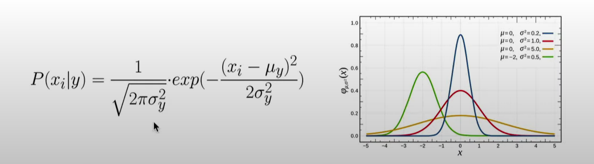

## Naive Bayes -- Clearly Explained

Note: When most people want to learn about Naive Bayes, thay want to learn about the Multinomial Naive Bayes Classifier, and that's what we talk about in this video.
However, just know that there is another commonly used version of Naive Bayes, called Gaussian Naive Bayes Classification.
Probabilities vs Likelihoods

# Easy understand 
- Train    
    - Make the histogram of each features for each lables case

    - Compute probabilities of each features of each labels case in our train_set.

    - Compute probabilities of each lable in our train_set. (Prior Probability)
- Test
    - Multipulate probabilities of each feature together and multipulate with each Prior Probabilities to get the result that propotional to the probbability of each class given feature's observation

    - With each observation, we take argmax to get the label with highest posterior probability
- Note
    We should worrier about the case that have at least one probability of a random feature of a random lablel case equal by zero. SO that this label no longer in our predicted since it's probability of the observation is also equal by zero

    To work  around this problem, people usually add 1 count to each feature in the histograms.
    Note: The number of counts we add to each feature is typically referred to alpha. IN this case, alpha equals one, but we could have set it to anything. 
# Technology
    The NAive Bayes classifier is a "probabilistic classifier" based on applying Bayes'theorem with strong (naive) independence assumptions between the features.

    Bayes'Theorem in our case: P(label|features) = P(features|label) * P(label) / P(feaetures)

    Assumption works really well for this classifier.

    Then we can get rid of P(features) because it depends not on label at all

    Our posterior probabilities are values between 0 and 1 and become very small so we can run into incurracy.
    So a little trick that instead of the product, we apply the logarithm so we can change our product with a sum and this is the final formula to get label y.

    Calculate components:
        P(label): Prior probability --> Frequency of each class
        P(features|label): Class conditional probability --> Model with Gaussian
            

- Training
    Calculate mean, var and prior (frequency) for each class
- Prediction
    Calcualte posterior for each class with above formula and gaussian formual.

    Choose class with highest posterior probability.